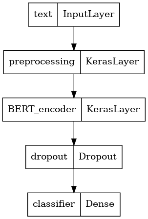
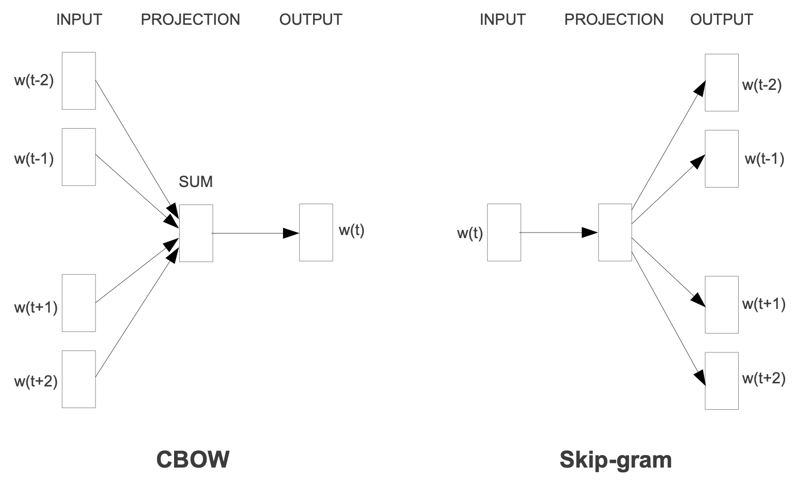
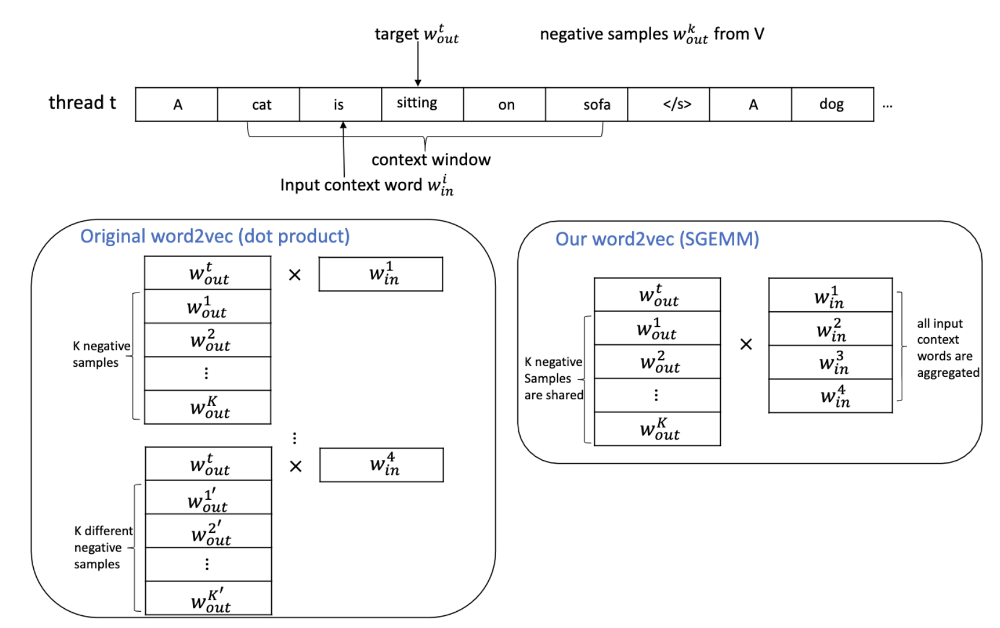
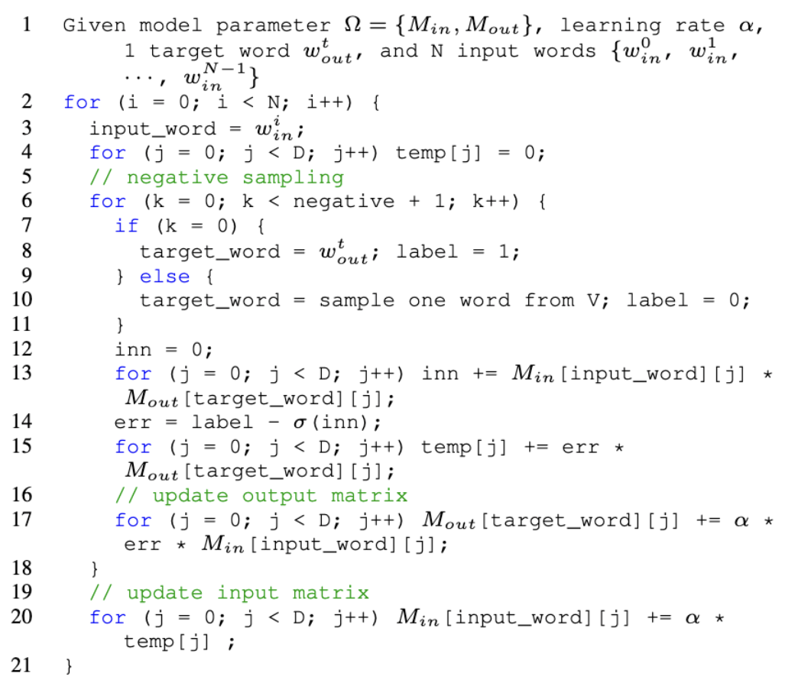

```{r setup, include=FALSE, message=FALSE}
knitr::opts_chunk$set(fig.pos = 'H', echo = FALSE, warning = FALSE, message = FALSE, comment = NA)
library(rmarkdown)
library(knitr)
library(tidyverse)
library(dplyr)
# base_family = 'STXihei'
```

# 摘要 {-}

我们使用电影评论文本进行情感分类模型的训练。^[项目地址：https://github.com/wuyuchong/spark_text_classification]我们在分布式集群上基于 spark 框架使用 python 和 scala 进行机器学习，为了与分布式训练进行对比，我们同时在单机服务器上进行深度学习。

我们首先进行文本清洗，之后使用 tokenizer、vectorize、Word2Vec等文本特征工程方法；在训练阶段，我们进行了单机深度学习和集群机器学习两种方式：在深度学习中，我们构建了 DNN、LSTM、BERT 等多个深度学习模型进行训练，最终达到了 90% 的准确率。为了模拟在超大文本集上进行训练，我们使用基于 Spark 的分布式算法在集群服务器上进行训练，使用 scala 语言进行了 logit 回归，使用 pyspark 构建了决策树、梯度助推树、随机森林模型，使用网格搜索的方式进行参数调整，最终达到了 88% 的准确率。

通过分布式与单机的对比，分布式模型在该小型数据集上没有优势，仅有在文本量级超过单机可承载上限时，分布式计算才具备意义。

最后，我们重点阐述了我们在训练过程中使用的文本特征工程算法 Word2Vec 的原理，解释了其在分布式实现上的挑战和解决方案。

|   模型         | 计算配置    | 用时   | 准确率 | 可拓展性 |
|   ------------ | ----------- | ------ | ------ | -------- |
|   scala - logit    |中央财经大学大数据高性能分布式集群 | 10 分钟 | 83% | 高-集群 |
| pyspark - 决策树   |中央财经大学大数据高性能分布式集群 | 40 分钟 | 85% | 高-集群 |
|pyspark - 梯度助推树|中央财经大学大数据高性能分布式集群 | 20 分钟 | 87% | 高-集群 |
| pyspark - 随机森林 |中央财经大学大数据高性能分布式集群 | 1.5小时 | 88% | 高-集群 |
|   tokenize + DNN   |阿里云服务器 Xeon 8 核 CPU 32G 内存| 10 分钟 | 60% | 低-单机 |
|   Word2Vec + LSTM  |阿里云服务器 Xeon 8 核 CPU 32G 内存| 2  小时 | 80% | 低-单机 |
|   bert - 小型      |阿里云服务器 Xeon 8 核 CPU 32G 内存| 1  小时 | 86% | 低-单机 |
|   bert - AL        |阿里云服务器 Xeon 8 核 CPU 32G 内存| 1.5小时 | 88% | 低-单机 |
|   bert - 标准      |阿里云服务器 Xeon 8 核 CPU 32G 内存| 3  小时 | 90% | 低-单机 |

\newpage

\setcounter{tocdepth}{2}
\tableofcontents

\newpage

# 数据集介绍

我们选择了 IMDB 的电影评论文本数据进行大数据建模研究。

IMDB 是一个隶属于亚马逊公司旗下的世界著名互联网电影资料库（Internet Movie Database）。它有着关于电影演员、电影、电视节目、电视明星和电影制作的在线数据，包括了影片的众多信息、演员、片长、内容介绍、分级、评论等，在电影评论评分时被广泛使用。IMDB 的论坛也十分活跃，除每个数据库条目都有留言板之外，还有关于多种多样的主题的各种综合讨论版。

我们将 IMDB 的电影评论文本用于自然语言处理的二元情感分类。我们使用 5 万条标有积极和消极标签的真实用户电影评论文本构建情感分类模型。 即使用深度学习算法预测评论为正面或是负面。

我们使用的文本为多语言文本，其中英文文本数量占绝大多数比例。

Table: 数据集概览

|              评论|情感|
|--------------------|---------|
|One of the other ...| positive|
|A wonderful littl...| positive|
|I thought this wa...| positive|
|Basically there's...| negative|
|Petter Mattei's "...| positive|
|Probably my all-t...| positive|
|I sure would like...| positive|

# 分布式训练

## 用户自定义函数与第三方库

* 由于在 UDF（用户自定义）函数中使用了第三方库，需要将其发送至集群中的每个计算节点 `--py-files gensim.zip`

## 数据读取

由于数据为逗号分隔的 `csv` 格式，在文本列出现混淆。我们使用 pandas 进行读取后再转换为 spark DataFrame 格式，并将分类标签转换为数字以便建模。

## 文本清洗

1. 去除标签
    * 将一些网页 HTML 特有的标签进行去除，如 `p` `br` 等
1. 去除标点符号
    * 将常用标点符号进行去除，如 `! ;` 等
1. 去除多余的空格
    * 删除无意义的连续性空格
1. 去除数字
    * 由于数字对文本情感识别作用小，我们选择将其删去
1. 去除停用词
    * 对意义较小的常用词进行删除
1. 去除过短的词汇
    * 由于英文中过短的字符一般意义较小，我们选择将其删去
1. 大小写统一
    * 大小写代表同一词汇，需要进行统一

Table: 文本清洗前后比较

|              review|sentiment|          clean_text|label|
|--------------------|---------|--------------------|-----|
|" Så som i himmel...| positive|som himmelen spec...|  1.0|
|"A Thief in the N...| positive|thief night film ...|  1.0|
|"A bored televisi...| negative|bore televis dire...|  0.0|
|"A death at a col...| negative|death colleg camp...|  0.0|
|"A wrong-doer is ...| positive|wrong doer man le...|  1.0|

## 文本特征工程

我们使用 TF-IDF 和 Word2Vec 两种方式进行文本特征工程。

### TF-IDF

词频-逆文档频率（TF-IDF）是一种广泛用于文本挖掘的特征向量化方法，它反映了单个词汇相对于语料库中文档的重要性。我们用表示 $t$ 代表词汇，用 $d$ 代表 表示文档，用 $D$ 表示语料库。词频 $TF(t, d)$ 是该词在文档 $d$ 中出现的次数，而文档频率 $DF(t, D)$ 是包含该词的文档的数量。如果我们只使用词频来衡量重要性，很容易过分强调那些出现频率很高但几乎没有关于文档的信息的词，例如“这”“的”等词汇。如果一个术语在语料库中经常出现，则意味着它不包含有关特定文档的特殊信息。逆文档频率是一个术语提供多少信息的数值度量：

$$I D F(t, D)=\log \frac{|D|+1}{D F(t, D)+1}$$

其中 $|D|$ 是语料库中的文档总数。

由于使用对数，如果一个词出现在所有文档中，它的 IDF 值变为 0，因此使用平滑词以避免对语料库之外的词除以零。TF-IDF 是 TF 和 IDF 的乘积：

$$T F I D F(t, d, D)=T F(t, d) \cdot I D F(t, D)$$

在 TF 的基础上，我们使用改进版的 HashingTF 进行处理。HashingTF 将词汇转换为固定长度的特征向量。HashingTF 利用散列表应用哈希函数映射词汇到索引，之后通过映射的函数计算词频，能有效降低 TF 在大型语料库所需的时间。

我们从一组句子开始，将每个句子分成单词，构建词袋，使用 HashingTF 将句子散列成特征向量，使用 IDF 重新缩放特征向量，然后将我们的特征向量传递给学习算法。

\newpage

### Word2Vec

对于 Word2Vec，我们将在后文详细阐述该算法的原理及其分布式实现。

Table: Word2Vec 转换示例 

|          clean_text|     filtered_tokens|  vectorizedFeatures|
|--------------------|--------------------|--------------------|
|som himmelen spec...|[som, himmelen, s...|(61505,[1,5,7,8,1...|
|thief night film ...|[thief, night, fi...|(61505,[0,1,7,20,...|
|bore televis dire...|[bore, televis, d...|(61505,[0,4,7,14,...|
|death colleg camp...|[death, colleg, c...|(61505,[0,6,8,15,...|
|wrong doer man le...|[wrong, doer, man...|(61505,[1,2,4,6,9...|

## 训练模型

我们首先使用简单的 logistic 模型进行拟合，在训练集上进行拟合，之后在测试集上验证模型的效果。

Table: 预测结果示例

|评论|真实值|预测值|
|-----|----------|----------|
|""" S? som i himm...|  1.0|       1.0|
|"""A bored televi...|  0.0|       0.0|
|"""A death at a c...|  0.0|       1.0|
|"""A trio of trea...|  0.0|       0.0|
|"""A wrong-doer i...|  1.0|       1.0|
|"""Ah Ritchie's m...|  1.0|       1.0|
|"""All men are gu...|  1.0|       1.0|

## 模型预测

我们准备了两个测试用例来验证模型是否有效。

1. 我喜欢这部电影
2. 它很差劲

模型对前一个句子的分类结果为积极，对一个句子的分类结果为消极。

## 模型调参

在 logistic 模型的基础上，我们还搭建了随机森林模型、梯度助推树模型、决策树模型。

我们使用网格搜索的方式对几个模型的超参数进行调整，选取最优的模型。

# 单机深度学习

为了与分布式机器学习进行比较，我们进行了单机的深度学习训练。

我们使用了 Tokenize 进行预处理，搭建神经网络模型。

```{r}
神经网络层 = c('输入层', 'drop out (50%)', '中间层', 'drop out (50%)', '输出层')
神经元个数 = c(512, 0, 512, 0, 1)
参数个数 = c(512512, 0, 262656, 0, 513)
table = data.frame(神经网络层, 神经元个数, 参数个数)
kable(table, caption = 'Tokenize + DNN 的结构（总参数个数：775681）')
```

进一步地，使用 Word2Vec 进行特征工程后搭建 LSTM 模型。

```{r}
神经网络层 = c('Embedding', '双向LSTM', '全连接', '输出层')
神经元个数 = c(64, 128, 64, 1)
参数个数 = c(64000, 66048, 8256, 65)
table = data.frame(神经网络层, 神经元个数, 参数个数)
kable(table, caption = 'LSTM 网络结构（总参数个数：138369）')
```

为了进一步提高准确率，我们用预训练的 BERT 模型进行迁移学习。

```{r, out.width='30%', fig.align='center', fig.cap='BERT 模型结构示意图'}

```

由于我们重点在分布式算法，深度学习部分不展开阐述。

# 算法比较

Table: 各类型模型用时及准确率比较

|   模型         | 计算配置    | 用时   | 准确率 | 可拓展性 |
|   ------------ | ----------- | ------ | ------ | -------- |
|   scala - logit    |中央财经大学大数据高性能分布式集群 | 10 分钟 | 83% | 高-集群 |
| pyspark - 决策树   |中央财经大学大数据高性能分布式集群 | 40 分钟 | 85% | 高-集群 |
|pyspark - 梯度助推树|中央财经大学大数据高性能分布式集群 | 20 分钟 | 87% | 高-集群 |
| pyspark - 随机森林 |中央财经大学大数据高性能分布式集群 | 1.5小时 | 88% | 高-集群 |
|   tokenize + DNN   |阿里云服务器 Xeon 8 核 CPU 32G 内存| 10 分钟 | 60% | 低-单机 |
|   Word2Vec + LSTM  |阿里云服务器 Xeon 8 核 CPU 32G 内存| 2  小时 | 80% | 低-单机 |
|   bert - 小型      |阿里云服务器 Xeon 8 核 CPU 32G 内存| 1  小时 | 86% | 低-单机 |
|   bert - AL        |阿里云服务器 Xeon 8 核 CPU 32G 内存| 1.5小时 | 88% | 低-单机 |
|   bert - 标准      |阿里云服务器 Xeon 8 核 CPU 32G 内存| 3  小时 | 90% | 低-单机 |

# Word2Vec 的分布式实现

在前文的建模过程中，我们多次使用到了文本特征工程算法 Word2Vec。Word2Vec 在自然语言处理中作为基础的一步，在它的基础上文本分类、相似查询、多语言翻译、问答系统等应用获得了很好的效果。

## 原始算法

Word2Vec 将单词表示为低维度向量，在训练得当的情况下，意思相近的单词在具有相似的向量表示。且 Word2Vec 这种向量表示具有良好的加减性质，如*国王* - *男人* + *女人*能够得到近似*王后*的向量。

词汇的向量化表示一般使用一个较浅的神经网络进行训练，训练的目标即为尽可能地使得每个词汇的向量表示能够用来预测上下文词汇，或是被周围的词汇预测，基于此一般有两种训练 Word2Vec 的方法：CBOW 和 Skip-gram。CBOW 使用上下文词汇的向量表示作为输入训练目标词汇，Skip-gram 训练目标词汇的向量表示以达到最好的预测上下文词汇的效果，两种方法并没有本质上的区别。

```{r, out.width='70%', fig.align='center', fig.cap='CBOW 和 Skip-gram 的比较'}

```

以 Skip-gram 为例，给定一个按顺序的词汇序列 $w_{1}, w_{2}, w_{3}, \ldots, w_{T}$，训练的目标即为最大化对数似然函数：

$$J(\Omega)=\frac{1}{T} \sum_{t=1}^{T} \sum_{-c \leq j \leq c, j \neq 0} \log p\left(w_{t+j} \mid w_{t}\right)$$

其中$c$是上下文滑动窗口的尺寸，$p\left(w_{t+j} \mid w_{t}\right)$ 是给定 $w_{t+j}$ 时中心词出现的概率。

在原始的惯用的算法中，使用一个简单的只含一个隐藏层的神经网络进行训练，使用 softmax 作为输出层的激活函数：

$$p\left(w_{O} \mid w_{I}\right)=\frac{\exp \left(\left\langle\mathbf{v}_{i n}^{w_{I}}, \mathbf{v}_{o u t}^{w_{O}}\right\rangle\right)}{\sum_{w=1}^{V} \exp \left(\left\langle\mathbf{v}_{i n}^{w_{I}}, \mathbf{v}_{o u t}^{w}\right\rangle\right)}$$

其中，$V$ 表示代表语料库的大小，$\langle\cdot, \cdot\rangle$ 代表两个向量的内积。

这种计算方式与语料库的大小成正比，但语料库非常大的时候是比较耗时的。

## 改进算法

通过负采样的方式，我们可以近似对数的 softmax 函数：

$$\begin{aligned}
\log p\left(w_{O} \mid w_{I}\right) & \approx \log \sigma\left(\left\langle\mathbf{v}_{i n}^{w_{I}}, \mathbf{v}_{o u t}^{w_{O}}\right\rangle\right) \\
&+\sum_{k=1}^{K} \mathbb{E}_{w_{k} \sim P_{n}(w)}\left[\log \sigma\left(-\left\langle\mathbf{v}_{i n}^{w_{I}}, \mathbf{v}_{o u t}^{w_{k}}\right\rangle\right)\right],
\end{aligned}$$

其中 $\sigma(x)=\frac{1}{1+\exp (-x)}$ 是 sigmoid 函数，式中的期望值通过随机抽取的词汇计算，这样就不需要计算整个语料库，通过牺牲较小精度的近似算法达到了节省时间的目的。然而尽管如此，对于互联网行业的大规模上线应用，语料库十分巨大，训练 Word2Vec 模型的时间通常需要以天为单位计。

## 分布式实现

为了进一步缩短训练时间，我们有必要将 Word2Vec 进行分布式实现，在集群中的各个计算节点之间分配计算任务。

```{r, out.width='99%', fig.align='center', fig.cap='Word2Vec 原算法与分布式实现的比较示意图'}

```

Word2Vec 分布式实现的挑战之一是随机梯度下降算法。随机梯度下降是一个迭代算法，在每一次迭代挑选出一组输入和输出词向量，然后进行微小的更新。因此随机梯度下降算法本质上是与并行相排斥的，通过多线程的方式并行进行更新可能会导致冲突，比如两个线程同时更新到同一个词。

所以我们通过尽量避免多线程冲突的方式进行随机梯度下降算法的并行实现，即使发生了更新的冲突，仍然应该允许迭代继续进行。

```{r, out.width='50%', fig.align='center', fig.cap='Word2Vec 算法分布式实现的伪代码'}

```

在伪代码中，矩阵 $M_{i n}^{V \times D}$ 包含了每一个输入词汇的向量表示，矩阵 $M_{out}^{V \times D}$ 包含了每一个输出词汇的向量表示，这些矩阵每次迭代进行更新（第 17 - 20 行）。在分布式实现中，伪代码中的最外层循环事实上是由多个计算节点并行计算的。伪代码的第 6 行挑选一个正的样本（第 8 行的目标词汇）或是一个负的样本（第 10 行）。伪代码的第 13 - 15 行计算了对应的输入词汇和正负样本的目标函数的梯度。

由于这种并行算法打破了传统 SGD 算法必须依赖连续且顺序迭代的惯例，理论上会降低算法的收敛能力，然而在实践中只要语料库足够大，多线程同时使用到同一个词的概率并不大，这种冲突是可控的且一般不会影响到收敛性。

# 心得与收获

在本学期的课程上，我有了很多的收获。也许与其他同学不同，对他们来说可能 Linux 的操作、远程登陆服务器还是一件新鲜的事情，不过这对我来说并不陌生，所以我基本没有经历到其他同学初期适应命令行的过渡期，从而有了更多地时间去认识和思考整个分布式生态的原理、构建及其应用。之前在滴滴数据科学部实习时，我稍微接触到了 pyspark，但是不管对底层或是应用都还所知甚少。经过本学期对 hadoop 框架、mapReduce 数据处理范式的学习，我对分布式的理解逐渐透彻。

其实我也有时候会思考，整个学期的课程到了我真正工作时又有多少知识会用得到，未来我大概率不会去开发分布式应用、去撰写分布式算法，可能也就是调用现有的模块进行数据建模。对这个问题，李丰老师给出的答案是这门课程并不是要将我们培养成为码农，我们大概率也不会去开发算法，但我们需要明白分布式背后的原理，这样才能在实际工作中知道哪些是可行的、哪些是不可行的，各种方案的优势和局限在哪里，进行大规模的业务上线需要付出的代价和取得的收益有多少，这些会影响我们推动很多业务，这些更广阔的视野在我们走上数据科学的更高的职位时一定会有所帮助。相比分布式的知识，老师这些对数据科学领域的见解对我更加触动，非常感谢李丰老师！

# 参考文献

